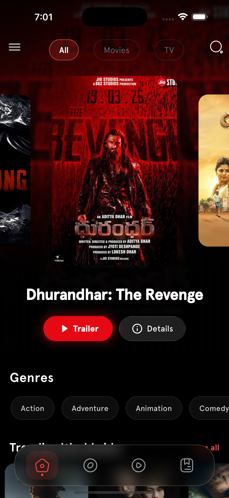
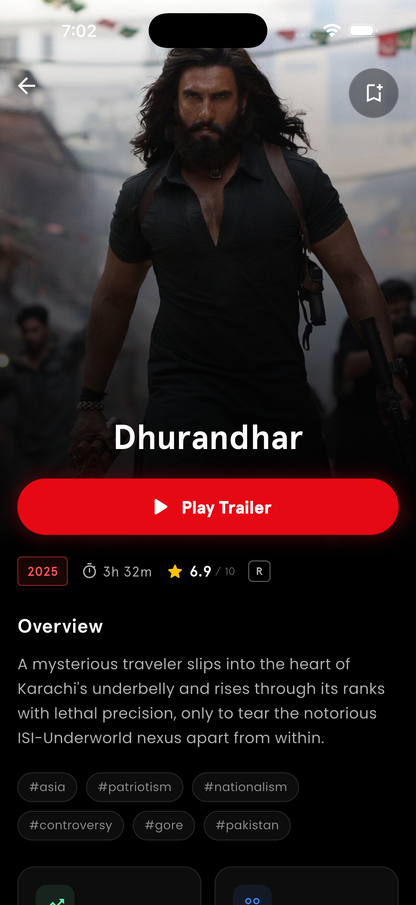
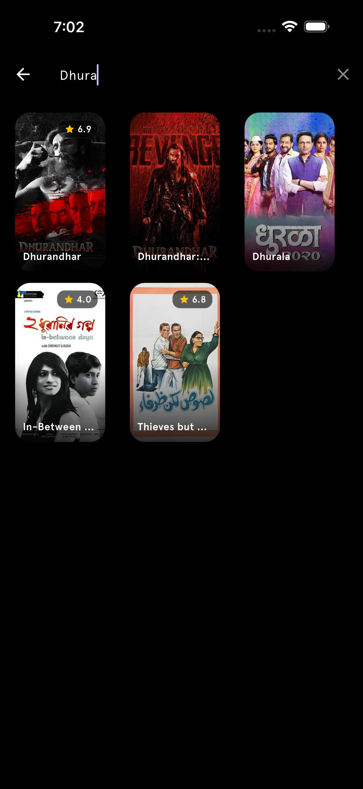

# Mojocinema: Movie Discovery Platform

Mojocinema is a high-performance, premium movie discovery application built with Flutter. It utilizes a state-of-the-art glassmorphic design system to provide an immersive experience for exploring global cinema, regional Indian content, and high-fidelity media trailers.

---

## Visual Experience & Interface Design

<div align="center">
  <table>
    <tr>
      <td></td>
      <td></td>
    </tr>
    <tr>
      <td></td>
      <td></td>
    </tr>
  </table>
</div>

---

## Technical UI Hierarchy & Architecture

The application follows a modular, widget-based architecture designed for high performance and visual consistency.

### Design Philosophy: "Dynamic Glassmorphism"
- **Layered Transparency**: Uses a hierarchy of `BackdropFilter` and `ClipRRect` to create multi-layered glass effects.
- **Atmospheric Synchronization**: The background layer of the application dynamically reflects the color palette of the current media asset using real-time image analysis.
- **Adaptive Typography**: Utilizes the 'Apercu' font family with a bold, high-contrast weight system (W900 for headers) to ensure readability against dynamic backgrounds.

### Structural Component Tree
1. **Scaffold Manager**: Global background handling and transparent status bar management.
2. **Flexible AppBar Layer**: A parallax-enabled `SliverAppBar` that transitions from transparent to solid obsidian-black upon scrolling.
3. **Glassmorphic Navigation**: A semi-transparent bottom navigation unit using `ImageFilter.blur` to maintain visual continuity.
4. **Content Carousels**: Optimized horizontal `ListView` builders with smart asset-loading guards.

---

## Detailed Component Walkthrough

### 1. Unified Home Dashboard (`home_page.dart`)
The primary engine for content discovery. It integrates multiple data streams into a cohesive feed.
- **Hero Animation System**: An interactive carousel that serves as the visual anchor. It includes data-quality validation to filter out titles with missing posters or backdrops.
- **Categorization Logic**: A state-driven toggle system (All, Movies, TV) that dynamically updates API endpoints without refreshing the entire page.
- **Localized Content Priority**: Specifically engineered to rank Indian regional trends and upcoming releases higher in the feed hierarchy.

### 2. Deep Media Infrastructure (`MovieDetails.dart`)
A high-density information page for movies and series.
- **Hero Image Header**: A parallax background utilizing the movie's backdrop with a custom glass-overlay navigation system.
- **Mojocinema Bookmark Integration**: A bespoke, animated bookmark button with real-time watchlist synchronization and visual state feedback.
- **Technical Metadata**: Automated parsing of release dates, runtimes (converted to H:M format), and age-based certifications (U, U/A, A).
- **Keyword Processing Engine**: Intelligently extracts tags from the TMDB database to provide immediate thematic context (e.g., #Action, #Drama, #IndianCinema).

### 3. Media hub & Trailer Engine (`vid.dart`)
- **Integrated Video Pipeline**: A full-screen YouTube integration designed for high-bitrate trailer playback.
- **Reliability Layer**: Built-in exception handling for YouTube API failures, displaying professional glassmorphic placeholders when assets are unavailable.
- **Secondary Assets**: Provides a scrollable list of "Teasers," "Behind the Scenes," and "Official Clips."

### 4. Search & Discovery Engine (`search_page.dart`)
- **Real-time Query Filtering**: Optimized for speed, providing instant search results as the user types.
- **Actor Intelligence**: Dedicated integration for searching actors, directing to a full-featured Actor Detail Page with biographies and filmography.

### 5. Collection Management (`watchlist_page.dart`)
- **Persistence Layer**: Local data management for user collections.
- **Haptic Feedback Interface**: Integrated with the bookmark system to provide physical confirmation when adding content.

---

## Technical Specifications

- **UI Framework**: Flutter (Dart)
- **Data Architecture**: TMDB REST API Integration
- **Layout System**: ScreenUtil (Responsive scaling)
- **Rendering Optimization**: CachedNetworkImage (Image buffering & RAM management)
- **State Pattern**: ValueListenable & Stateful Widget persistence
- **Dependency Management**: AGP 8.9.1 / Gradle 8.11.1 (Optimized for Java 21)

---

## Getting Started & Implementation

### Prerequisites
- Flutter SDK (Stable)
- TMDB API Key (Available at [themoviedb.org](https://www.themoviedb.org/documentation/api))

### Configuration
1. **Deployment**:
   ```bash
   git clone https://github.com/maisachinsharmahu/MojoCinema.git
   cd MojoCinema
   flutter pub get
   ```
2. **API Secret**:
   Rename `lib/api/example_apikey.dart` to `apikey.dart` and insert your API key into the `apikey` constant.
3. **Production Build**:
   ```bash
   flutter build apk --release
   ```

---

## License & Legal Attribution

Distributed under the **MIT License**.

### 🎨 UI design & Visual Policy
The UI design, technical layout, and glassmorphic aesthetic of **Mojocinema** are the intellectual property of **Sachin Sharma**. You are granted permission to build upon the code, provided that a prominent attribution is maintained:
- **"UI Design by Sachin Sharma (Mojocinema)"**
- Repository: https://github.com/maisachinsharmahu/MojoCinema

---
<div align="center">
  <b>Developed & Maintained by <a href="https://github.com/maisachinsharmahu">Sachin Sharma</a></b>
</div>
